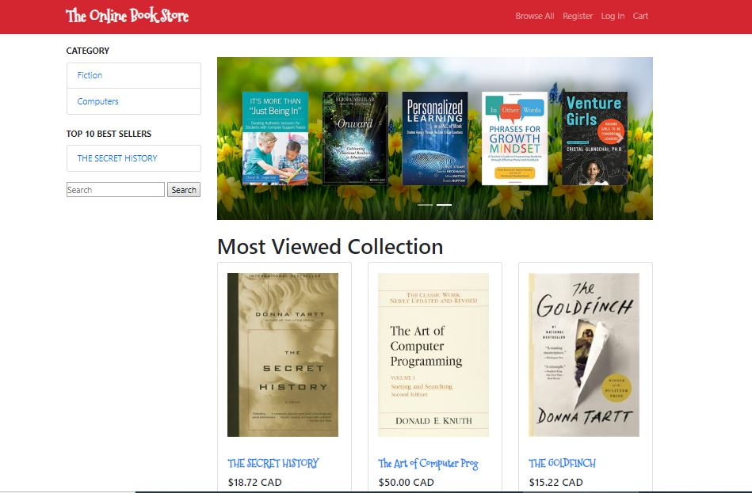
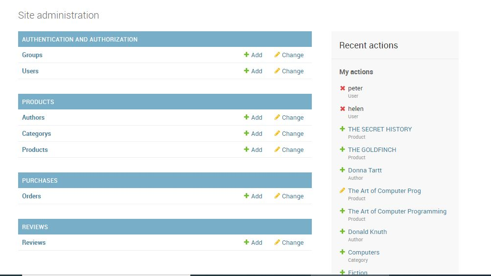
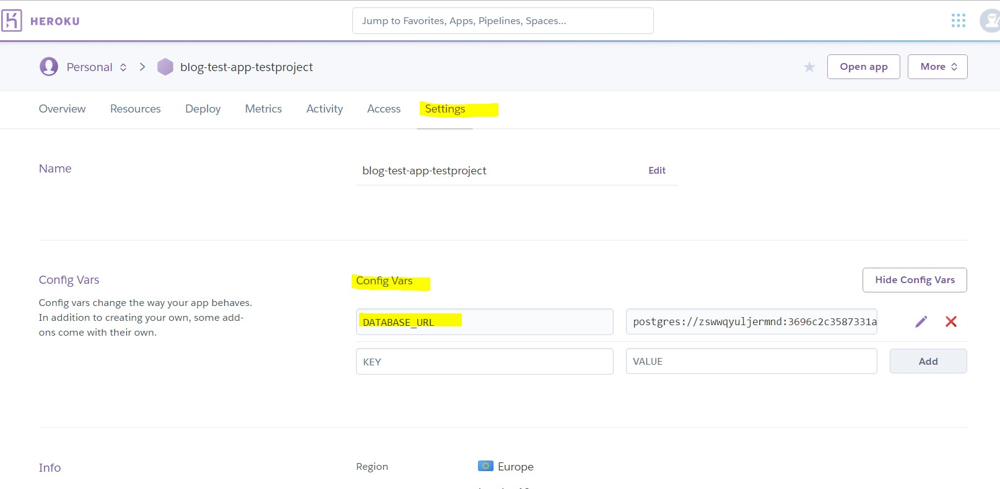

# [Online Book Store Ecommerce Website](https://online-book-store-ecommerce.herokuapp.com/)

**Table of Contents**

1. [ Overview of the project ](#overview)
2. [ UX -Insights of the project ](#insights)
3. [ User Stories ](#userstories)
4. [ Design Process ](#design)
5. [ Features](#features)
6. [ Technologies Used ](#technologies)
7. [ Testing ](#testing)
8. [ Deployment ](#deployment)
9. [ Credits ](#credits)
10. [ Acknowledgements ](#acknowledgement)

<a name="overview"></a>
### Overview of the project
- The main objective of this Ecommerce Website is to manage the details of Books, Stock, Customer, Order and Payment.
- The Online book store also allows users to search and purchase a book online based on title, author and other keywords. 
- The selected books are displayed in a tabular format in a cart and the user can order their books online through credit card payment. Using this Website the user can purchase a book online instead of going out to a book store and wasting time.



<a name="insights"></a>
## UX
### Insights of the project
- Customer can purchase books online. 
- Through this web browser the customers can search for a book by its title or author, or specific keywords.
- Sorting feature based on price both ascending and descending is also provided to ease search of a product
- Allows users to see specific details about a book like book title, price, author name, description, instock and total views. 
- Using Authentication mechanism a user can login using his account details or new customers can set up an account very quickly
- Books can be added to the shopping cart and finally purchase using credit card transaction
- Users have to register to persist their shopping cart between sessions
- The user can also write reviews about a book by giving ratings on a score of five. 
- Pagination feature allows users concentrate on a particular amount of content
- The books are divided into many categories based on subject like Fiction, Comics, Gospel etc.


<a name="userstories"></a>
#### User Stories
**"Rochelle loves books and wants to buy one of her favourites"**
- As a user she can browse through the list of books ,or browse through book based on Authors ,Categories or search keywords. 
Sorting feature can also advance her search if she wishes to browse based on price.
- Pagination feature at the bottom on the page will display particular number of books in pages giving her a to focus on few books at a time.
- As a user she can click the individual book she finds to see more information and even see reviews about the book

**"Rochelle wants to purchase a book"**
- As a user, finding the book of her choice  she can add the book to the cart. The  cart functionality allows her to update quantity or delete the total items she buying 
- As a user , buying the book requires her to register herself and proceed to checkout
- As a user she can use the checkout functionality to process her order and get the book she is interested in.

**"Kate as a returning customer"**
- As a user , she can leave a review about the book by leaving comments and ratings out of 5 for others to see.This would help other customers to make a choice about buying the book or no.

**"John does not find the book instore"**
- As a user ,he can access this website to check if an item is in stock or not, and proceed to buying .

- Logout feature is also provided.

<a name="design"></a>
#### Design Process

[Schema diagram](https://www.dropbox.com/s/ii6ipaeryhgdlo1/Relational%20schema.jpg?dl=0)<br/>
While working on the application new features and changes were made on the design of the wireframe<br/>
[Wireframes for Desktop](https://www.dropbox.com/s/rl6qirupp6cfna8/Wireframe%20for%20Desktop.pdf?dl=0)<br/>
[Wireframes for IPhone](https://www.dropbox.com/s/6m8o5ha3vz1swoh/Wireframe%20for%20Iphone.pdf?dl=0)<br/>
[Wireframes for IPad](https://www.dropbox.com/s/8a3o977hn0k2nug/Wireframe%20for%20Ipad.pdf?dl=0)<br/>


<a name="features"></a>
## Features

#### Existing Features

The following features are added to the application which is geared towards enhancing the user online experience. This multipage application provides a menu to access the various features of the application

**Apps**

Home
Cart
Products
Purchases
Search
Reviews
Accounts

**Home**- serves as an initial landing page for all users. Users are able to access the following :
- A static clickable navigation menu with items like Home, Browse All , Login, Register
- Have a snick peek at the top 3 most popular books as card.
- Add to cart button will add the book to the cart.
- Clicking the book title or the book cover image redirects to book detail page to see more information about the book
- List of existing author and Categories is displayed on the left side of the home Page to advance search
- Search provided at the at the left of the page to Search books on any search keywords
- A Carousal displaying 2 random images from different websites at a set interval.
- If a valid user logs in displays a message "Welcome "

*Pages* : base .html and home.html

**Login** – this creates an entry for returning users with existing accounts
- Provide a link to Register if the user has not yet logged in
- Clicking the login on the menu, directs the user to an input form to enter login details like username and password
- The Login form provides validations for fields that are required and also checks if login is successful
- Signing in the form creates opens the home page and clickable menu which now includes additional features Home, 
- Clicking on the Logout initiates a session time out and the user lands again on the home page with the additional features removed

*Pages* : Login.html

**Browse all**  this page displays a wide collection of books.
*The search section*
- Provides a list for a filtered view based on the following criteria Category and Author
- Search option - search for books by book title, most important by author,categories or specific keywords.
- Sorting feature to sort book based on price low to high and high to low is also provided in form of a drop down

*The book collection section*
- When this page is first time loaded a list of books  are displayed in form of a card  which the user can browse.
- Pagination feature is incorporated so that users do not get lost and can concentrate on a particular amount of content, the page display 6 books at each time. The user can view the list of next 6 books by clicking on the pagination links provided at the bottom of the page.
- Clicking a book card opens up detail information about the book.

**Searched Books**– this page displays list of books based on filtered criteria
- Provides users with book cards of books based on search criteria Results for: Fiction
- The user can also get back to the book page by clicking |browse all” link in the menu.
- Pagination feature is incorporated so that users do not get lost and can concentrate on a particular amount of content, the page display 6 books at each time.
- The user can view the list of next 6 books by clicking on the pagination links provided at the bottom of the page

**Book Detail**
- individual book page accessed through clicking the book image or the book title link provided in the card.
- It uses an entire page to display a full book information with larger text and the book image at its full capacity to the user.
- Upon viewing it increments the book view count. 
- If a valid user has logged in he/she will be able to leave a comment and rating about the book.

*Pages* : product_detail.html

**Review**
- The review form provided in the product detail page allows a valid logged in user to leave a comment and rating out of 5 for the book displayed
- This comment is than added to the list of customer reviews
- If the user has not logged in he/she will be shown a message to loggin to leave a comment however he/she will be able to view other customer reviews

**Cart**
- Adding a book to the cart will display a clickable cart option in the menu displaying the total items in the cart.
- The cart can be viewed by clicking the cart link on the menu bar.
- On opening the cart a tabular display giving information about the item added will be displayed like Book image, book title, number of copies , option to change the quantity or remove the item from the cart.
- Updating the quantity updates the price by the quantity displaying the new total of the cart.

*Pages* : cart.html

**Checkout**
- Clicking the checkout button on the cart page redirects the user to the checkout page again giving the final list of the items with the cart as well as the total amount. This is the order placed by a valid customer
- This page also provided a form to enter payment details like customer information and credit card information
- Submitting an order finally saves the order for the customer for processing (not implemented) as well as updates the quantity in stock for the product.

*Pages* : checkout.html

<a name="technologies"></a>
## Technologies Used
** Django**
 -  Python Web Framework-Used to build the web application
 Dependencies used:
  - django-forms-bootstrap : bootstrap filter for Django forms
   - dj-database-url: allows you to utilize the DATABASE_URL environment variable to configure your Django application.
  - whitenoise: allows your web app to serve its own static files
   -  Gunicorn: Python WSGI server for UNIX
   -  Pillow : support for most common image formats.
   -  psycopg2 PostgreSQL database adapter for Python
   
  **Installs made to the project**
- `~/workspace $ sudo pip3 install django==1.11`
- `~/workspace $ sudo pip3 install django-forms-bootstrap`
- `~/workspace $ sudo pip3 install Pillow`
- `~/workspace $ sudo pip3 install stripe`
- `~/workspace $ sudo pip3 install dj-database-url`
- `~/workspace $ sudo pip3 install psyscopg2-binary`
- `~/workspace $ sudo pip3 install Flask`
- `~/workspace $ sudo pip3 install whitenoise`
   
** Stripe **
- Ecommerce payments functionality ,using Stripes test functionality rather than actual live payments.

**Heroku** <link>(https://www.heroku.com/)
- Deploy and scale Python apps

**HTML5** : to create structure of webpage.<br/>
**CSS3**: to style webpage, I used external stylesheet, file located in static/css/custom.css .<br/>
**Google Fonts**: for additional font-family options https://fonts.google.com/.<br/>
**Font Awesome**: for social media icons and envelope icon https://fontawesome.com/.<br/>
** Bootstrap 4.3**-developing responsive HTML pages

**JQuery**
- This project uses Jquery to simplify DOM manipulation and provide better UX.

**Backend Database**
- For local development used sqlite3
- On Heroku, PostgreSQL was used

**Version Control**
- Git and GitHub

** Other Services used**
- Amazon S3 Bucket
- Travis CI : for continuous Integration testing

<a name="testing"></a>
## Testing
- The web application has been tested to make it responsive this is tested in Google Chrome Developer tools responsive mode on Galaxy S5, Pixel 2, Pixel 2XL,iPhone 5/SE, iPhone 6/7/8, iPhone Plus 6/7/8, iPhone X, iPad, iPad Pro.
- Web application is also been viewed on different browsers like Google Chrome,Firefox and Internet Edge
- Tested button and links directed to desired page.

**Testing scenarios**
**Home(base.html and home_page.html)**–"Test PASS"
- The home page is responsive and conforms to the browser size.
- The navigation bar collapses to a burger icon when viewed on medium and small devices. On hovering on each of the link the color it highlights the active link
- Tested every link on the navigation bar and verified that I was directed to the appropriate sections.
- Filtering criteria on the left side when clicked directs to the list of books with selection criteria results displayed
- Search functionality works for any keywords keyed in the text box
- Clicking any of the top 3 popular viewed books opens the detailed information of the book.
- Clicking the add to cart button in the book cards adds the book to the cart

**Footer- Social media** "Test PASS"

- Social media link - Clicked the social media icon i.e. github and confirmed it directs you to the desired site.
- On small devices the social media and copyright are centered on the webpage.
- Go to top link in the footer directs the user to the tp of the page

**Browse All( product_list.html)** "Test PASS"
- Tested that pagination works and displays 6 books at a time from the list of collection of books.
- The navigation links on the pagination also works as desired
- - Filtering criteria on the left side when clicked directs to the list of books with selection criteria results displayed
- Search functionality works for any keywords keyed in the text box
- Sorting functionality based on prices works as desired and displays books based on sorting criteria low to high price and high to low price
- Clicking any of the book cards on a page opens the detailed information of the book.
- Clicking the add to cart button in the book cards adds the book to the cart

**Product detail(product_detail.html)** "Test PASS"
- Tested that the countof views gets incremented when any user browses a book detail
- The number of reviews for that particular book is displayed
- Tested that Add to Cart and View Cart buttons do the desired actions
- Tested that only after logging in a user can write a review about a book.
- Back to Previous Page directs the user to the Book Collection 

**Cart(cart.html)**"Test PASS"
- Tested that a quantity of a book can be updated this reflects a newprice total.
- Remove on clicked removes the item from the cart.
- Checkout will direct to the checkout page provided the users has successfully logged in ,if no the user willbe directed to the Login Page

**Checkout(checkout.html)**"Test PASS"
- Confirms an order placed by the user.
- Tested that after succesfully filling credit card details the order information is stored in Orders for that user.
- Test data used fro Credit Card is 4242424242424242
Security Code (ccv) 111
Month : 1
Year:  2022
- Tested that after a order has been confirmed the instock quantity gets reduced ,this can be viewed by going to product details page of the book

- Another feature tested here is if the total number of books in stock is equal to 0 the Add to Cart button displays "Out of Stock" 

**Register(register.html)** –"Test PASS"
-  Tested the link to open Register page
- Verified error message on the form when the mandatory fields were left blank.
- Verified error message on the form when the mandatory fields were left blank. This also included the proper email format (xxx@xx.xxx) on testing.
- Verified if same username has been supplied by displaying a message username already exist
- Verified that both passwords need to match

**Login(login.html) **–"Test PASS"
- Tested the link to open Login page
- Verified error message on the form when the mandatory fields were left blank.
- Verified for invalid user name and password
- Login page tested for username:helen and password:helen_123

** Site administrator Dashboard**
- Tested that valid entries can be made to each of thye models in the database created locally



<a name="deployment"></a>
## Deployment

- Project is built on AWS Cloud 9 (https://aws.amazon.com/cloud9/)

#### Running code locally

- django-admin startproject bookstore .
 - Start new project with name bookstore in root dir
- django-admin startapp home
 - Start app in django project. the app have its own views. it is component to project.
- python3 manage.py runserver $IP:$C9_PORT
  - To start server. This command can be added to .bash_aliases file alias run="python3 ~/workspace/manage.py runserver $IP:$C9_PORT"
- Eventually "run" command can be used to run the project locally
- All apps created need to be registed in INSTALLED_APPS in the settings fle of the start project
- When Modals are created the following commands need to be executed to create the modals through migrations
 -`~/workspace $ python3 manage.py makemigrations`
  -`~/workspace $ python3 manage.py migrate`
- To create a dmin dashboard create a superuser using following command
  -`~/workspace $ •	python3 manage.py createsuperuser`
  
  
#### Git deployment
The files have been edited in this development instance. When ready, the changes were "deployed" to the staging instance. After user acceptance and testing, deploy again, this time to production. I used git and GitHub pages for deployment.
The following steps are followed to deploy the pages:
1.	Initialised the local directory in my project as a git repository used the cloud9 terminal to perform this step `$git init`
2.	Added the files in the local repository created. And staged them for commit `$git add .`
3.	Commited the files that I have staged in the local repository. 
`$git commit –m ”Initial commit”` This step is perfomed for any changes I have done to sections in webpages and stylesheets as well as the images and audios folder.
4.	Created a new repository in Github and in the terminal, added the URL for the remote repository where your local repository will be pushed.
5.	On major changes I have pushed the changes in the local repository to GitHub. `$git push origin master`
Github Link: <link>(https://github.com/nadia-solution-tracker/full-stack-milestome-project)

#### Heroku deployment Steps
1.	Create our Heroku app on <link>(https://www.heroku.com/)
2. Add postgres database as compare to sqlite by clicking Resources->Addons ->Heroku Postgres
3. Add Config Vars : Secret_key and Database Url



4.Changes to settings.py file to incorporate 

```pythoncode
if "DATABASE_URL" in os.environ:
  DATABASES = {
     'default': dj_database_url.parse(os.environ.get('DATABASE_URL'))
    }
else:
    print("Database URL not found. Using SQLite instead")
    DATABASES = {
        'default': {
            'ENGINE': 'django.db.backends.sqlite3',
            'NAME': os.path.join(BASE_DIR, 'db.sqlite3'),
        }
    }
```

and

 `~/workspace $ sudo pip3 install whitenoise`

```pythoncode
MIDDLEWARE = [
    'whitenoise.middleware.WhiteNoiseMiddleware',
]
```

Run following commands again
 -`~/workspace $ python3 manage.py makemigrations`
  -`~/workspace $ python3 manage.py migrate`
To create a dmin dashboard create a superuser using following command
  -`~/workspace $ •	python3 manage.py createsuperuser`
  
 5.Add a collection point in setting.py
 ```pythoncode
STATIC_ROOT = os.path.join(BASE_DIR, 'staticfiles')
```
6.Create a **requirements.txt** file, which will install the dependencies for our project and tell Heroku that we're using Python.<br/>
`~/workspace (master) $ sudo pip3 freeze --local > requirements.txt`<br/>
`~/workspace (master) $ git add requirements.txt`<br/>
`~/workspace (master) $ git commit -m "creating requirements file "`<br/>
`~/workspace (master) $ git push origin master`<br/>

7.Create a **Procfile**.<br/>
 ```pythoncode
web: gunicorn bookstore.wsgi:application
```
`~/workspace (master) $ git add Procfile`<br/>
`~/workspace (master) $ git commit -m "Add Procfile"`<br/>

8.`~/workspace (master) $ pip install gunicorn<br/>
9.Add heroku link to allowed hosts
 ```pythoncode
ALLOWED_HOSTS = [‘online-book-store-ecommerce.herokuapp.com’]
```
10.Commit and push
11.Do automatic deploy from git by connect heroku to git master


<a name="credits"></a>
## Credits

Content
- Book Information taken from - https://www.chapters.indigo.ca/en-ca/ and google images

Code Logic
-	For apps Accounts,Cart ,Purchases - Code institute Videos and Miniproject ecommerce
- For pagination Code – https://simpleisbetterthancomplex.com/tutorial/2016/08/03/how-to-paginate-with-django.html
- For Ordering using select
https://tutorial.djangogirls.org/en/django_orm/
- For Reviews
https://www.codementor.io/jadianes/get-started-with-django-building-recommendation-review-app-du107yb1a

Also refered Google and forums for solutions to errors

- Images and Recipes
https://www.chapters.indigo.ca/en-ca/ and google images

Bugs and Solutions
- Ordering in drop down required writing javascript code for some reason onchange and submit was given an error finally used jquery to solve the problem
```pythoncode
 <script>
    $(function() {
      $('#sort-by-price').change(function() {
            $('#sorting-form').submit();
      });
    });
    </script>
```

<a name="acknowledgement"></a>
## Acknowledgements
I would extend my sincere thanks to my mentor for giving me ideas and reviewing my project and making it more efficient.Also I would thank Slack team and the Tutoring feature of Code Institute as well as all the Video training from  the Full stack module


